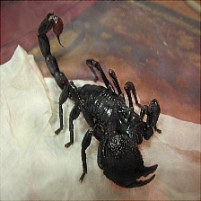
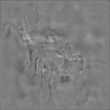

# Invisible Backdoor Attack with Sample-Specific Triggers
Here is the preview code of inserting ISSBA triggers and performing backdoor attack on resnet18.
The codes for the training and defense experiments will be released soon.

## Environment
This project is developed with Python 3.6 on Ubuntu 18.04. Please run the following script to install the required packages
```shell
pip install -r requirements.txt
```

## Demo
Before running the code, please download the checkpoints from [Baidudisk](https://pan.baidu.com/s/1m5yRFQ4Wt7Km_56CIxzgsg) (code:o89z) or [Onedrive](https://1drv.ms/u/s!Avxa3ueQCO4jgZ9ck7e1q_ANoqQi8Q?e=HXxEKo), and put them into `ckpt` folder.

1. Generating poisoned sample with sample-specific trigger. 
    ```python
    # TensorFlow
    python encode_image.py \
    --model_path=ckpt/encoder_imagenet \
    --image_path=data/imagenet/org/n01770393_12386.JPEG \
    --out_dir=data/imagenet/bd/ 
    ```

    |  |  | 
    |:--:| :--:| :--:| 
    | Benign image | Backdoor image | Trigger |

2. Runing `test.py` for testing benign and poisoned images.
    ```python
    # PyTorch
    python test.py
    ```

## Citation
Please cite our paper in your publications if it helps your research:

```
@inproceedings{li_ISSBA_2021,
  title={Invisible Backdoor Attack with Sample-Specific Triggers},
  author={Li, Yuezun and Li, Yiming and Wu, Baoyuan and Li, Longkang and He, Ran and Lyu, Siwei},
  booktitle={International Conference on Computer Vision (ICCV)},
  year={2021}
}
```

## Notice
This repository is NOT for commecial use. It is provided "as it is" and we are not responsible for any subsequence of using this code.
